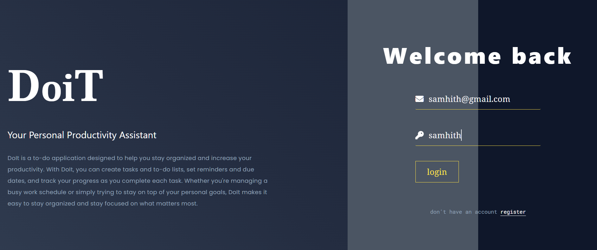
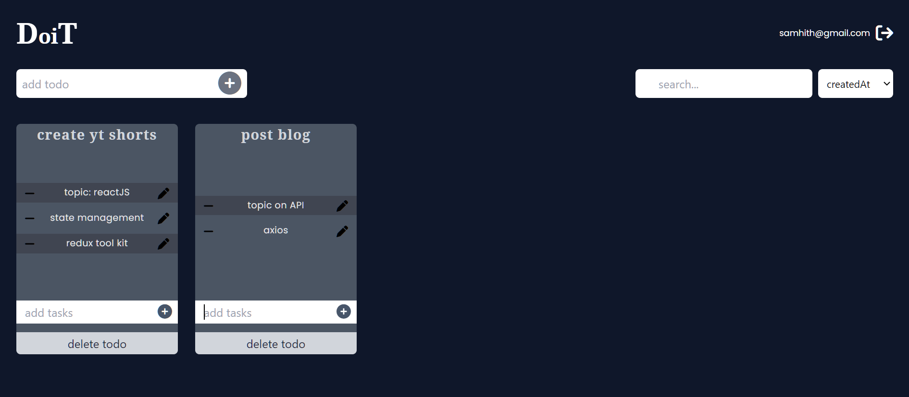

# DoiT

DoiT is a full-stack application built using NodeJS, ReactJS, ExpressJS,  and MongoDB. It allows users to create, read, update, and delete tasks and todos.

## Deployed Link
The application is currently deployed on Netlify. You can access it through this link: https://samhith40.netlify.app

## Features

DoiT has the following features:
- Create, read, update, and delete to-dos
- Create, read, update, and delete tasks within each to-do
- State management with Zustand
- API built with Node.js and Express.js
- Database management with MongoDB and Mongoose

## Testing with Postman
We recommend testing the API endpoints with Postman. You can find the Postman collection with name `todo.postman_collections.json . Simply import the collection into Postman and start testing the endpoints.

## Screenshots

## Installaion

1. Clone the repository: `https://github.com/SamhithMR/react-todo-app`
2. Navigate to the project directory: `cd your-repo`
3. Install dependencies: `npm install`
4. Start the development server: `npm run dev`
5. start the client application: `npm start`
6. Open the application in your browser at `http://localhost:3000`

## Usage

1. Add a new todo by clicking the "Add Todo" button and entering a name for the todo in the input field that appears.
2. Add a new task to a todo by clicking the "Add Task" button next to the todo and entering a task description in the input field that appears.
3. Edit a todo by clicking the "Edit" button next to the todo and entering a new name for the todo in the input field that appears.
4. Delete a todo by clicking the "Delete" button next to the todo.
5. Delete a task from a todo by clicking the "-" button next to the task.

